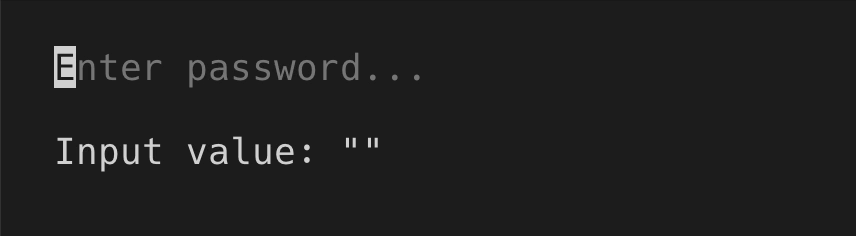
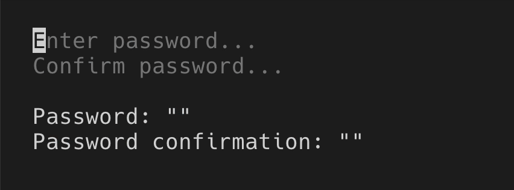

# Password input

> `PasswordInput` is used for entering sensitive data, like passwords, API keys and so on. It works the same way as `PasswordInput`, except input value is masked and replaced with asterisks ("\*").

[Theme](../source/components/password-input/theme.ts) | [Example code](../examples/password-input.tsx)

## Usage

`PasswordInput` is an uncontrolled component. You can listen to value changes via `onChange` prop.

```tsx
import React, {useState} from 'react';
import {render, Box, Text} from 'ink';
import {PasswordInput} from '@inkjs/ui';
import input from '../helpers/input.js';

function Example() {
	const [value, setValue] = useState('');

	return (
		<Box flexDirection="column" gap={1}>
			<PasswordInput placeholder="Enter password..." onChange={setValue} />
			<Text>Input value: "{value}"</Text>
		</Box>
	);
}

render(<Example />);
```



### Submit on enter

When you're only looking for the final value when user presses <kbd>enter</kbd>, you can use `onSubmit` instead of `onChange` prop.

```tsx
import React, {useState} from 'react';
import {render, Box, Text} from 'ink';
import {PasswordInput} from '@inkjs/ui';

function Example() {
	const [value, setValue] = useState('');

	return (
		<Box flexDirection="column" gap={1}>
			<PasswordInput placeholder="Enter password..." onSubmit={setValue} />
			<Text>Input value: "{value}"</Text>
		</Box>
	);
}

render(<Example />);
```


### Disabled

When there are two or more password inputs, only one should be receiving user input at a time, while others should be disabled via `isDisabled` prop.

```tsx
import React, {useState} from 'react';
import {render, Box, Text} from 'ink';
import {PasswordInput} from '@inkjs/ui';
import input from '../helpers/input.js';
import press from '../helpers/press.js';

function Example() {
	const [activeInput, setActiveInput] = useState('password');
	const [password, setPassword] = useState('');
	const [passwordConfirmation, setPasswordConfirmation] = useState('');

	return (
		<Box padding={2} flexDirection="column" gap={1}>
			<Box flexDirection="column">
				<PasswordInput
					isDisabled={activeInput !== 'password'}
					placeholder="Enter password..."
					onChange={setPassword}
					onSubmit={() => {
						setActiveInput('passwordConfirmation');
					}}
				/>

				<PasswordInput
					isDisabled={activeInput !== 'passwordConfirmation'}
					placeholder="Confirm password..."
					onChange={setPasswordConfirmation}
					onSubmit={() => {
						setActiveInput('none');
					}}
				/>
			</Box>

			<Box flexDirection="column">
				<Text>Password: "{password}"</Text>
				<Text>Password confirmation: "{passwordConfirmation}"</Text>
			</Box>
		</Box>
	);
}

render(<Example />);
```



## Props

### isDisabled

Type: `boolean`\
Default: `false`

When disabled, user input is ignored.

### placeholder

Type: `string`

Text to display when input is empty.

### onChange(value)

Type: `Function`

Callback when input value changes.

#### value

Type: `string`

Input value.

### onSubmit(value)

Type: `Function`

Callback when enter is pressed.

#### value

Type: `string`

Input value.
