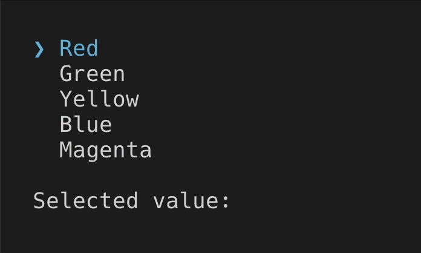
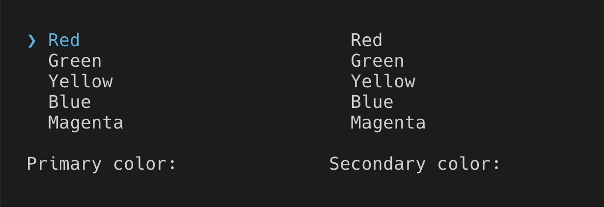

# Select

> `Select` shows a scrollable list of options for a user to choose from.

[Theme](../source/components/select/theme.ts) | [Example code](../examples/select.tsx)

## Usage

`Select` is an uncontrolled component. You can listen to value changes via `onChange` prop.

```tsx
import React, {useState} from 'react';
import {render, Box, Text} from 'ink';
import {Select} from '@inkjs/ui';

function Example() {
	const [value, setValue] = useState<string | undefined>();

	return (
		<Box padding={2} flexDirection="column" gap={1}>
			<Select
				options={[
					{
						label: 'Red',
						value: 'red',
					},
					{
						label: 'Green',
						value: 'green',
					},
					{
						label: 'Yellow',
						value: 'yellow',
					},
					{
						label: 'Blue',
						value: 'blue',
					},
					{
						label: 'Magenta',
						value: 'magenta',
					},
					{
						label: 'Cyan',
						value: 'cyan',
					},
					{
						label: 'White',
						value: 'white',
					},
				]}
				onChange={setValue}
			/>

			<Text>Selected value: {value}</Text>
		</Box>
	);
}

render(<Example />);
```



### Default value

Default value can be set via `defaultValue` prop.

```tsx
import React, {useState} from 'react';
import {render, Box, Text} from 'ink';
import {Select} from '@inkjs/ui';

function Example() {
	const [value, setValue] = useState('green');

	return (
		<Box padding={2} flexDirection="column" gap={1}>
			<Select
				defaultValue={value}
				options={[
					{
						label: 'Red',
						value: 'red',
					},
					{
						label: 'Green',
						value: 'green',
					},
					{
						label: 'Yellow',
						value: 'yellow',
					},
					{
						label: 'Blue',
						value: 'blue',
					},
					{
						label: 'Magenta',
						value: 'magenta',
					},
					{
						label: 'Cyan',
						value: 'cyan',
					},
					{
						label: 'White',
						value: 'white',
					},
				]}
				onChange={setValue}
			/>

			<Text>Selected value: {value}</Text>
		</Box>
	);
}

render(<Example />);
```


### Disabled

When there are two or more selects, only one should be receiving user input at a time, while others should be disabled via `isDisabled` prop.

```tsx
import React, {useState} from 'react';
import {render, Box, Text} from 'ink';
import {Select} from '@inkjs/ui';

const options = [
	{
		label: 'Red',
		value: 'red',
	},
	{
		label: 'Green',
		value: 'green',
	},
	{
		label: 'Yellow',
		value: 'yellow',
	},
	{
		label: 'Blue',
		value: 'blue',
	},
	{
		label: 'Magenta',
		value: 'magenta',
	},
	{
		label: 'Cyan',
		value: 'cyan',
	},
	{
		label: 'White',
		value: 'white',
	},
];

function Example() {
	const [activeInput, setActiveInput] = useState('primary');
	const [primaryColor, setPrimaryColor] = useState<string | undefined>();
	const [secondaryColor, setSecondaryColor] = useState<string | undefined>();

	return (
		<Box>
			<Box flexDirection="column" gap={1} width={28}>
				<Select
					isDisabled={activeInput !== 'primary'}
					options={options}
					onChange={value => {
						setPrimaryColor(value);
						setActiveInput('secondary');
					}}
				/>

				<Text>Primary color: {primaryColor}</Text>
			</Box>

			<Box flexDirection="column" gap={1} width={28}>
				<Select
					isDisabled={activeInput !== 'secondary'}
					options={options}
					onChange={value => {
						setSecondaryColor(value);
						setActiveInput('none');
					}}
				/>

				<Text>Secondary color: {secondaryColor}</Text>
			</Box>
		</Box>
	);
}

render(<Example />);
```



## Props

### isDisabled

Type: `boolean`\
Default: `false`

When disabled, user input is ignored.

### visibleOptionCount

Type: `number`\
Default: `5`

Number of visible options.

### highlightText

Type: `string`

Highlight text in option labels.

### options

Type: `Array<{ label: string; value: string; }>`

Options.

### defaultValue

Type: `string`

Default value.

### onChange(value)

Type: `Function`

Callback when selected option changes.

#### value

Type: `string`

Value of the selected option.
