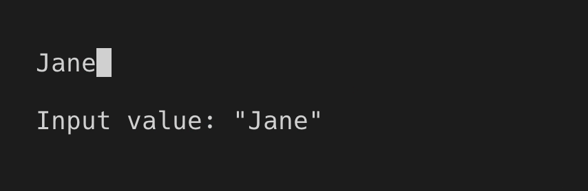
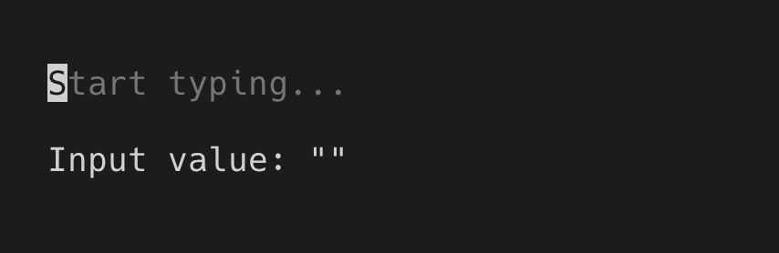
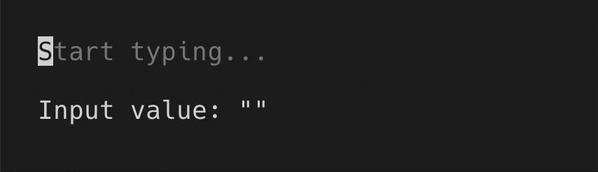
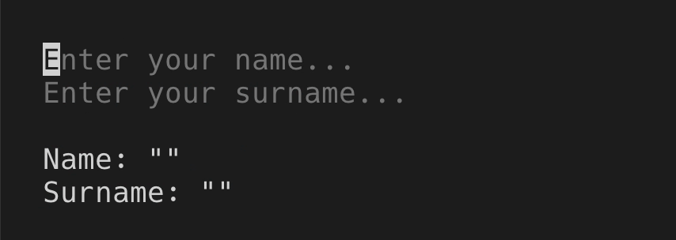

# Text input

> `TextInput` is used for entering any single-line input with an optional autocomplete.

[Theme](../source/components/text-input/theme.ts) | [Example code](../examples/text-input.tsx)

## Usage

`TextInput` is an uncontrolled component. You can listen to value changes via `onChange` prop.

```tsx
import React, {useState} from 'react';
import {render, Box, Text} from 'ink';
import {TextInput} from '@inkjs/ui';

function Example() {
	const [value, setValue] = useState('');

	return (
		<Box flexDirection="column" gap={1}>
			<TextInput placeholder="Start typing..." onChange={setValue} />
			<Text>Input value: "{value}"</Text>
		</Box>
	);
}

render(<Example />);
```


### Default value

Default value can be set via `defaultValue` prop.

```tsx
import React, {useState} from 'react';
import {render, Box, Text} from 'ink';
import {TextInput} from '@inkjs/ui';

function Example() {
	const [value, setValue] = useState('Jane');

	return (
		<Box flexDirection="column" gap={1}>
			<TextInput
				placeholder="Start typing..."
				defaultValue={value}
				onChange={setValue}
			/>

			<Text>Input value: "{value}"</Text>
		</Box>
	);
}

render(<Example />);
```



### Autocomplete

`TextInput` can suggest values to autocomplete input with via `suggestions` prop, which contains an array of strings.
As user is typing, `TextInput` finds the first item in `suggestions` array that begins with an input string that user has already entered. Matching of items in `suggestions` is case-sensitive.

When user presses <kbd>enter</kbd>, current suggestion will replace the input value.

```tsx
import React, {useState} from 'react';
import {render, Box, Text} from 'ink';
import {TextInput} from '@inkjs/ui';

function Example() {
	const [value, setValue] = useState('');

	return (
		<Box flexDirection="column" gap={1}>
			<TextInput
				placeholder="Start typing..."
				suggestions={['Abby', 'Angel', 'Annie']}
				onChange={setValue}
			/>

			<Text>Input value: "{value}"</Text>
		</Box>
	);
}

render(<Example />);
```



### Submit on enter

When you're only looking for the final value when user presses <kbd>enter</kbd>, you can use `onSubmit` instead of `onChange` prop.

```tsx
import React, {useState} from 'react';
import {render, Box, Text} from 'ink';
import {TextInput} from '@inkjs/ui';

function Example() {
	const [value, setValue] = useState('');

	return (
		<Box flexDirection="column" gap={1}>
			<TextInput placeholder="Start typing..." onSubmit={setValue} />
			<Text>Input value: "{value}"</Text>
		</Box>
	);
}

render(<Example />);
```



### Disabled

When there are two or more text inputs, only one should be receiving user input at a time, while others should be disabled via `isDisabled` prop.

```tsx
import React, {useState} from 'react';
import {render, Box, Text} from 'ink';
import {TextInput} from '@inkjs/ui';

function Example() {
	const [activeInput, setActiveInput] = useState('name');
	const [name, setName] = useState('');
	const [surname, setSurname] = useState('');

	return (
		<Box flexDirection="column" gap={1}>
			<Box flexDirection="column">
				<TextInput
					isDisabled={activeInput !== 'name'}
					placeholder="Enter your name..."
					onChange={setName}
					onSubmit={() => {
						setActiveInput('surname');
					}}
				/>

				<TextInput
					isDisabled={activeInput !== 'surname'}
					placeholder="Enter your surname..."
					onChange={setSurname}
					onSubmit={() => {
						setActiveInput('none');
					}}
				/>
			</Box>

			<Box flexDirection="column">
				<Text>Name: "{name}"</Text>
				<Text>Surname: "{surname}"</Text>
			</Box>
		</Box>
	);
}

render(<Example />);
```



## Props

### isDisabled

Type: `boolean`\
Default: `false`

When disabled, user input is ignored.

### placeholder

Type: `string`

Text to display when input is empty.

### defaultValue

Type: `string`

Default input value.

### suggestions

Type: `string[]`

Suggestions to autocomplete the input value.

### onChange(value)

Type: `Function`

Callback when input value changes.

#### value

Type: `string`

Input value.

### onSubmit(value)

Type: `Function`

Callback when enter is pressed.

#### value

Type: `string`

Input value.
