[](https://github.com/vshymanskyy/StandWithUkraine/blob/main/docs/README.md)

# Ink UI [](https://github.com/vadimdemedes/ink-ui/actions/workflows/test.yml)

> Collection of customizable UI components for CLIs made with [Ink](https://term.ink).

## Install

```sh
npm install @inkjs/ui
```

_This assumes you've already set up [Ink](https://term.ink). The easiest way to get started is [create-ink-app](https://github.com/vadimdemedes/create-ink-app)._

## Components

### Text input

[Documentation](docs/text-input.md)

`TextInput` is used for entering any single-line input with an optional autocomplete.

```jsx
import {TextInput} from '@inkjs/ui';

<TextInput
	placeholder="Enter your name..."
	onSubmit={name => {
		// `name` contains user input
	}}
/>;
```

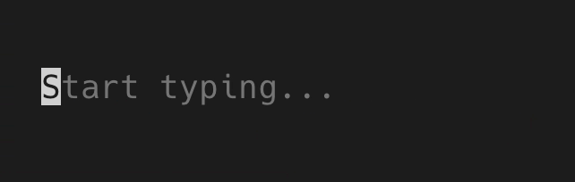

### Email input

[Documentation](docs/email-input.md)

`EmailInput` is used for entering an email. After "@" character is entered, domain can be autocompleted from the list of most popular email providers.

```jsx
import {EmailInput} from '@inkjs/ui';

<EmailInput
	placeholder="Enter email..."
	onSubmit={email => {
		// `email` contains user input
	}}
/>;
```

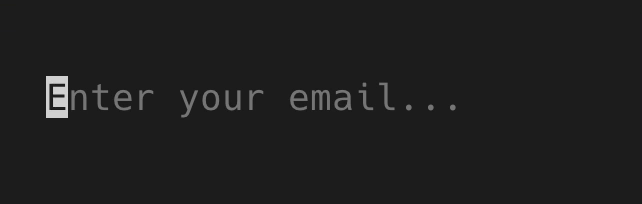

### Password input

[Documentation](docs/password-input.md)

`PasswordInput` is used for entering sensitive data, like passwords, API keys and so on. It works the same way as `TextInput`, except input value is masked and replaced with asterisks ("\*").

```jsx
import {PasswordInput} from '@inkjs/ui';

<PasswordInput
	placeholder="Enter password..."
	onSubmit={password => {
		// `password` contains user input
	}}
/>;
```

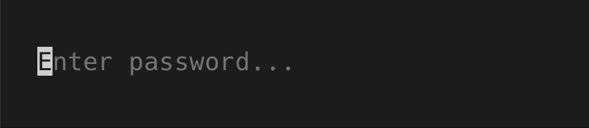

### Confirm input

[Documentation](docs/confirm-input.md)

`ConfirmInput` shows a common "Y/n" input to confirm or cancel an operation your CLI wants to perform.

```jsx
import {ConfirmInput} from '@inkjs/ui';

<ConfirmInput
	onConfirm={() => {
		// confirmed
	}}
	onCancel={() => {
		// cancelled
	}}
/>;
```

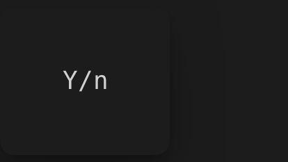

### Select

[Documentation](docs/select.md)

`Select` shows a scrollable list of options for a user to choose from.

```jsx
import {Select} from '@inkjs/ui';

<Select
	options={[
		{
			label: 'Red',
			value: 'red',
		},
		{
			label: 'Green',
			value: 'green',
		},
		{
			label: 'Yellow',
			value: 'yellow',
		},
		/* ... */
	]}
	onChange={newValue => {
		// `newValue` equals the `value` field of the selected option
		// For example, "yellow"
	}}
/>;
```

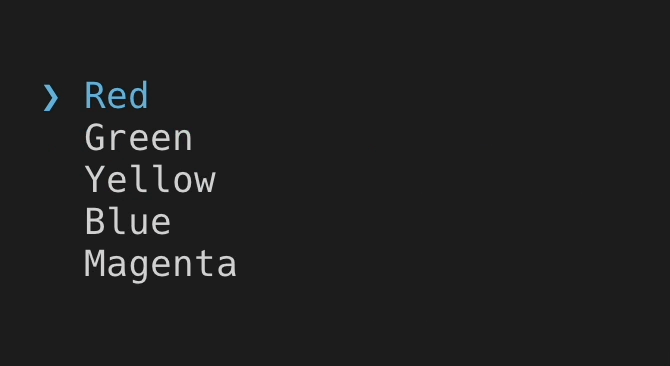

### Multi select

[Documentation](docs/multi-select.md)

`MultiSelect` is similar to `Select`, except user can choose multiple options.

```jsx
import {MultiSelect} from '@inkjs/ui';

<MultiSelect
	options={[
		{
			label: 'Red',
			value: 'red',
		},
		{
			label: 'Green',
			value: 'green',
		},
		{
			label: 'Yellow',
			value: 'yellow',
		},
		/* ... */
	]}
	onChange={newValue => {
		// `newValue` is an array of `value` fields of the selected options
		// For example, ["green", "yellow"]
	}}
/>;
```


### Spinner

[Documentation](docs/spinner.md)

`Spinner` indicates that something is being processed and CLI is waiting for it to complete.

```jsx
import {Spinner} from '@inkjs/ui';

<Spinner label="Loading" />;
```

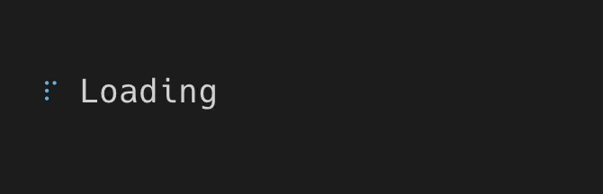

### Progress bar

[Documentation](docs/progress-bar.md)

`ProgressBar` is an extended version of `Spinner`, where it's possible to calculate a progress percentage.

```jsx
import {ProgressBar} from '@inkjs/ui';

// `progress` must be a number between 0 and 100
<ProgressBar value={progress} />;
```


### Badge

[Documentation](docs/badge.md)

`Badge` can be used to indicate a status of a certain item, usually positioned nearby the element it's related to.

```jsx
import {Badge} from '@inkjs/ui';

<Badge color="green">Pass</Badge>
<Badge color="red">Fail</Badge>
<Badge color="yellow">Warn</Badge>
<Badge color="blue">Todo</Badge>
```

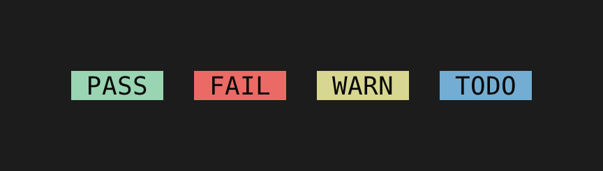

### Status message

[Documentation](docs/status-message.md)

`StatusMessage` can also be used to indicate a status, but when longer explanation of such status is required.

```jsx
import {StatusMessage} from '@inkjs/ui';

<StatusMessage variant="success">
	New version is deployed to production
</StatusMessage>

<StatusMessage variant="error">
  Failed to deploy a new version of this app
</StatusMessage>

<StatusMessage variant="warning">
    Health checks aren't configured
</StatusMessage>

<StatusMessage variant="info">
    This version is already deployed
</StatusMessage>
```

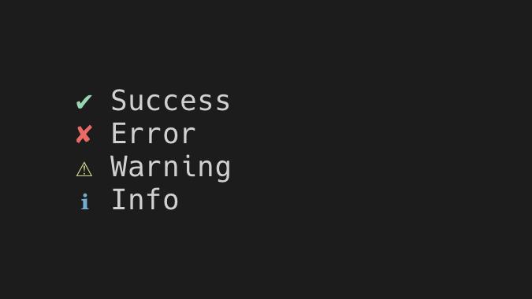

### Alert

[Documentation](docs/alert.md)

`Alert` is used to focus user's attention to important messages.

```jsx
import {Alert} from '@inkjs/ui';

<Alert variant="success">
    A new version of this CLI is available
</Alert>

<Alert variant="error">
    Your license is expired
</Alert>

<Alert variant="warning">
    Current version of this CLI has been deprecated
</Alert>

<Alert variant="info">
    API won't be available tomorrow night
</Alert>
```

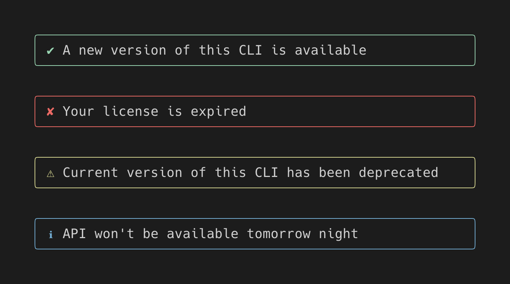

### Unordered list

[Documentation](docs/unordered-list.md)

`UnorderedList` is used to show lists of items.

```jsx
import {UnorderedList} from '@inkjs/ui';

<UnorderedList>
	<UnorderedList.Item>
		<Text>Red</Text>
	</UnorderedList.Item>

	<UnorderedList.Item>
		<Text>Green</Text>

		<UnorderedList>
			<UnorderedList.Item>
				<Text>Light</Text>
			</UnorderedList.Item>

			<UnorderedList.Item>
				<Text>Dark</Text>
			</UnorderedList.Item>
		</UnorderedList>
	</UnorderedList.Item>

	<UnorderedList.Item>
		<Text>Blue</Text>
	</UnorderedList.Item>
</UnorderedList>;
```

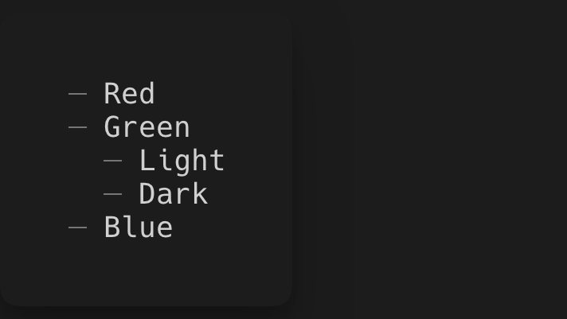

### Ordered list

[Documentation](docs/ordered-list.md)

`OrderedList` is used to show lists of numbered items.

```jsx
import {OrderedList} from '@inkjs/ui';

<OrderedList>
	<OrderedList.Item>
		<Text>Red</Text>
	</OrderedList.Item>

	<OrderedList.Item>
		<Text>Green</Text>

		<OrderedList>
			<OrderedList.Item>
				<Text>Light</Text>
			</OrderedList.Item>

			<OrderedList.Item>
				<Text>Dark</Text>
			</OrderedList.Item>
		</OrderedList>
	</OrderedList.Item>

	<OrderedList.Item>
		<Text>Blue</Text>
	</OrderedList.Item>
</OrderedList>;
```

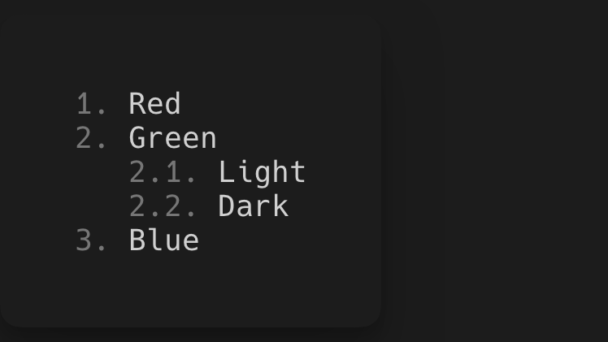

## Theming

All component have their styles defined in a theme, which is accessible to components via React context. Ink UI ships with a default theme and it can be customized or replaced with a different theme altogether.

Let's get a quick look on how to customize a `Spinner`'s component theme. Here's how it looks by default:


First, look up component's default theme, which will give an overview which parts does this component consist of. Documentation of each component includes a link to component's `theme.ts` file on top. In the case of `Spinner`, it's [source/components/spinner/theme.ts](source/components/spinner/theme.ts).

Here's the part we care about:

```tsx
const theme = {
	styles: {
		container: (): BoxProps => ({
			gap: 1,
		}),
		frame: (): TextProps => ({
			color: 'blue',
		}),
		label: (): TextProps => ({}),
	},
} satisfies ComponentTheme;

export default theme;
```

This component theme hints that `Spinner` has 3 parts: container, frame and a label. So to customize the color of the spinner itself, we'd want to change the `color` prop returned from the `frame` function.

To customize the default theme, use `extendTheme` function and make that custom theme available to children components via `ThemeProvider`.

```tsx
import {render, type TextProps} from 'ink';
import {Spinner, ThemeProvider, extendTheme, defaultTheme} from '@inkjs/ui';

const customTheme = extendTheme(defaultTheme, {
	components: {
		Spinner: {
			styles: {
				frame: (): TextProps => ({
					color: 'magenta',
				}),
			},
		},
	},
});

function Example() {
	return (
		<ThemeProvider theme={customTheme}>
			<Spinner label="Loading" />
		</ThemeProvider>
	);
}

render(<Example />);
```

With custom theme applied, `Spinner` now renders a magenta spinner, instead of the default blue one.

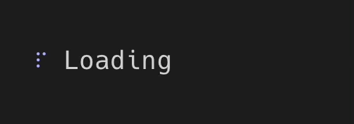

There are also cases where styles change based on some condition. For example, [`StatusMessage`](docs/status-message.md) changes the color of an icon based on the `variant` prop.

Here's a sample code from its [theme](source/components/status-message/theme.ts).

```ts
const colorByVariant = {
	success: 'green',
	error: 'red',
	warning: 'yellow',
	info: 'blue',
};

const theme = {
	styles: {
		icon: ({variant}) => ({
			color: colorByVariant[variant],
		}),
	},
};
```

Since each field in `styles` object is a function, it can return different styles based on the props that were passed in or a state of a component.

Component themes can also include configuration for rendering a component in a `config` object, that's not related to styling. For example, [`UnorderedList`](docs/unordered-list.md) specifies a `marker`, which is a character that's rendered before each list item.

Here's a sample code from its [theme](source/components/unordered-list/theme.ts).

```ts
const theme = {
	config: () => ({
		marker: '─',
	}),
};
```


Changing `marker` to `'+'` would render this:


Components shipped in Ink UI automatically read the necessary styles and configuration from a theme. However, if you're adding a new custom component and a theme for it, use `useComponentTheme` hook to access it.

```tsx
import React, {render, Text, type TextProps} from 'ink';
import {
	ThemeProvider,
	defaultTheme,
	extendTheme,
	useComponentTheme,
	type ComponentTheme,
} from '@inkjs/ui';

const customLabelTheme = {
	styles: {
		label: (): TextProps => ({
			color: 'green',
		}),
	},
} satisfies ComponentTheme;

type CustomLabelTheme = typeof customLabelTheme;

const customTheme = extendTheme(defaultTheme, {
	components: {
		CustomLabel: customLabelTheme,
	},
});

function CustomLabel() {
	const {styles} = useComponentTheme<CustomLabelTheme>('CustomLabel');

	return <Text {...styles.label()}>Hello world</Text>;
}

function Example() {
	return (
		<ThemeProvider theme={customTheme}>
			<CustomLabel />
		</ThemeProvider>
	);
}

render(<Example />);
```
